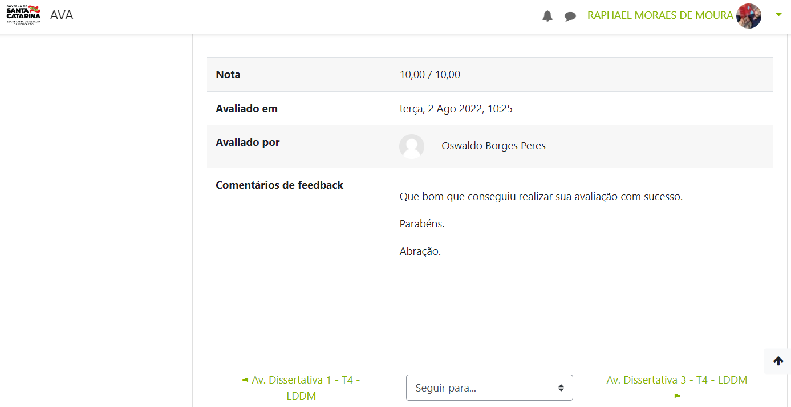

                     
## GatesOpen - GO - Android-App-Mobile 

#### Projeto de app desenvolvido em Java/Android apresentado como trabalho de conclusão de curso de Dev Mobile - CEDUP/SC

### Linguagem e Desenvolvimento para Dispositivos Móveis - Centro de Educação Profissionalizante - SC

Avaliação 2 – link do video de apresentação:
https://www.youtube.com/watch?v=00GktTYS--w

Turma: Programador de Dispositivos Móveis T4
Professor: Oswaldo Borges Peres

Componentes:
Raphael Moraes de Moura - raphael.phgru@gmail.com
Jane Aparecida da Silveira – janeminef@gmail.com
Leide Sayuri Ogasawara - leidesayuri@gmail.com
Fedia Joseph - f.y.joseph1998@gmail.com

### Nota da avaliação: 10

Aplicativo Gates Open - GO 

Descrição da resolução do problema buscado pelo Projeto:

Com a correria do dia a dia, os pais de crianças e jovens estão com tempo reduzido para buscar, pesquisar e encontrar atividades para seus filhos em horários de contraturno das aulas regulares. Pensando nessa problemática, desenvolveremos um aplicativo que una as informações de modo rápido e simples demonstrando aos pais de alunos matriculados na instituição “ABC” as listas de atividades disponíveis na instituição e possiblidades da reserva de matricula facilmente pelo app. Com isso as crianças e jovens terão oportunidades para desenvolverem seus talentos e interesses, onde muitas vezes por falta de tempo e dificuldades de comunicação não lhe são sugeridas e ofertadas. 

A princípio iremos fazer um aplicativo em que seja utilizado em uma só instituição. O aluno já está matriculado na escola, sendo assim fica mais fácil a inclusão de aulas extras no horário em que não se tenha aulas regulares, no caso, o horário do contraturno.
A intenção é fazermos um modelo experimental e que no futuro poderemos aprimorar e ampliar, incluindo parcerias com outros estabelecimentos como academias, escolas de dança, etc.... criando um grande banco de dados por região, com sugestões para pais e alunos, onde diversas aulas e atividades desportivas/extracurriculares podem ser encontradas. 

E assim, possamos dar um passo para uma futura revolução na educação, pois só conseguimos mudar uma estória de vida com educação.

